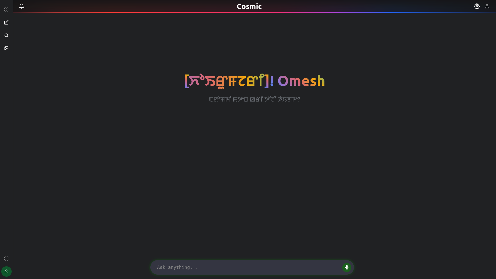

# Multilingual Voice Assistant

[](https://github.com/OmeshThokchom/Chatbot_manipur/stargazers)
[](https://github.com/OmeshThokchom/Chatbot_manipur/network/members)
[](https://github.com/OmeshThokchom/Chatbot_manipur/issues)
[](https://github.com/OmeshThokchom/Chatbot_manipur/pulls)


## Table of Contents
- [About](#about)
- [Demo](#demo)
- [Features](#features)
- [Tech Stack](#tech-stack)
- [Project Structure](#project-structure)
- [Getting Started](#getting-started)
  - [Prerequisites](#prerequisites)
  - [Backend Setup](#backend-setup)
  - [Frontend Setup](#frontend-setup)
- [Usage](#usage)
- [Contributing](#contributing)
- [License](#license)

## About
This project develops a sophisticated Multilingual Voice Assistant, specifically designed to facilitate natural language interactions in the **Manipuri (Meitei)** language. It integrates advanced speech recognition (ASR), text-to-speech (TTS), and machine translation capabilities with a generative AI model to provide a seamless conversational experience. The assistant aims to bridge language barriers and offer an intuitive interface for users to interact through voice commands and receive intelligent responses, with a strong emphasis on supporting the Manipuri linguistic community.

## Demo


## Features
- **Voice-Enabled Interaction:** Engage with the assistant using natural spoken language.
- **Primary Manipuri Language Support:** Dedicated focus on processing and generating responses in the Manipuri (Meitei) language.
- **Automatic Speech Recognition (ASR):** Converts spoken Manipuri and English into text for processing.
- **Text-to-Speech (TTS):** Generates natural-sounding speech responses from text in Manipuri and English.
- **Generative AI Responses:** Utilizes a large language model for intelligent and contextually relevant replies.
- **Real-time Translation:** Seamlessly translates between Meitei and English during conversations.
- **Intuitive User Interface:** A modern web-based frontend for an engaging user experience.

## Tech Stack
### Backend
- **Python:** Core programming language.
- **Flask:** Web framework for API development.
- **flask-cors:** Enables Cross-Origin Resource Sharing.
- **sounddevice, numpy, scipy, pydub:** Audio processing and manipulation.
- **onnxruntime:** High-performance inference for ONNX models (likely for ASR/TTS).
- **python-dotenv:** For managing environment variables.
- **requests:** HTTP client for making external API calls.
- **misaki:** (Specific library, likely for Meitei language processing or a component of ASR/TTS).

### Frontend
- **React:** JavaScript library for building user interfaces.
- **Vite:** Fast build tool for modern web projects.
- **TypeScript:** Superset of JavaScript for type-safe development.
- **highlight.js, marked, marked-highlight:** For rendering and syntax highlighting markdown content.
- **react-icons:** Popular icon library for React.

### AI/ML Components
- **Generative AI:** Integration with a large language model (e.g., GPT via `gpt_api.py`).
- **Meitei ASR:** Custom Automatic Speech Recognition models for the Meitei language.
- **Piper TTS:** Text-to-Speech system for generating natural voice output.
- **Grapheme-to-Phoneme (G2P):** For phonetic transcription, crucial for TTS.

## Project Structure
- `app.py`: Main backend application entry point.
- `chat_system.py`: Core logic for managing chat interactions.
- `meitei_chat_system.py`, `meitei.py`: Meitei-specific chat logic and utilities.
- `frontend/`: Contains the React-based web application.
  - `src/components/`: Reusable UI components (e.g., `ChatInput`, `ChatWindow`, `AudioVisualizer`).
  - `src/pages/`: Main application pages (e.g., `ChatPage`).
- `generative/`: Houses the generative AI model integration (`gpt_api.py`).
- `N7Speech/manipur_asr/`: Meitei Automatic Speech Recognition modules.
- `translator/`: Modules for English-Meitei and Meitei-English translation.
- `TTS/`: Text-to-Speech implementation (e.g., `piperTTS.py`).
- `token_generator/`: Grapheme-to-Phoneme (G2P) and tokenization utilities.
- `requirements.txt`: Python backend dependencies.
- `frontend/package.json`: Frontend dependencies and scripts.

## Getting Started

### Prerequisites
Before you begin, ensure you have the following installed:
- **Python 3.8+**
- **Node.js (LTS recommended)** and **npm** or **yarn**
- **Git**

### Backend Setup
1.  **Clone the repository:**
    ```bash
    git clone https://github.com/OmeshThokchom/Chatbot_manipur.git
    cd Chatbot_manipur
    ```
2.  **Create a virtual environment:**
    ```bash
    python -m venv venv
    source venv/bin/activate  # On Windows use `venv\Scripts\activate`
    ```
3.  **Install Python dependencies:**
    ```bash
    pip install -r requirements.txt
    ```
4.  **Environment Variables:**
    Create a `.env` file in the root directory and add necessary environment variables, such as API keys for generative models or other configurations.
    ```
    # Example:
    # OPENAI_API_KEY=your_openai_api_key
    ```
5.  **Run the Backend Server:**
    ```bash
    python app.py
    ```
    The backend server should start, typically on `http://127.0.0.1:5000`.

### Frontend Setup
1.  **Navigate to the frontend directory:**
    ```bash
    cd frontend
    ```
2.  **Install Node.js dependencies:**
    ```bash
    npm install
    # or yarn install
    ```
3.  **Run the Frontend Development Server:**
    ```bash
    npm run dev
    # or yarn dev
    ```
    The frontend application should open in your browser, typically on `http://localhost:5173` (or another port as indicated by Vite).

## Usage
Once both the backend and frontend servers are running, open your web browser and navigate to the frontend URL (e.g., `http://localhost:5173`). You can then interact with the voice assistant through the web interface. Speak into your microphone to provide input, and the assistant will respond with generated speech and text.

## Contributing
We welcome contributions to enhance this Multilingual Voice Assistant. Please follow these steps to contribute:
1.  Fork the repository.
2.  Create a new branch (`git checkout -b feature/YourFeature`).
3.  Make your changes.
4.  Commit your changes (`git commit -m 'Add some feature'`).
5.  Push to the branch (`git push origin feature/YourFeature`).
6.  Open a Pull Request.

## License
This project is licensed under the MIT License - see the LICENSE file for details.
